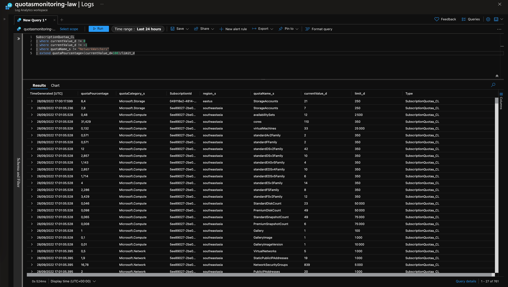
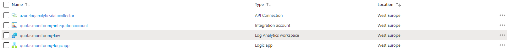
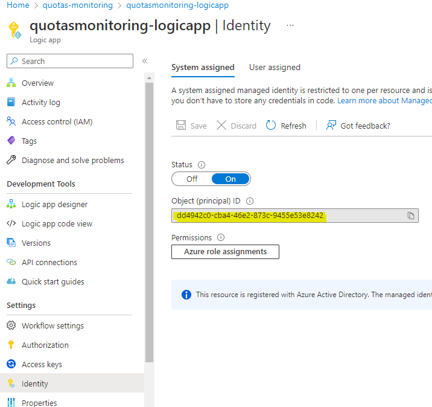

# Azure Quotas Monitoring - Export subscriptions quotas to a Log Analytics Workspace with a Logic App

This repo allows you to **export subscriptions quotas** to a **Log Analytics Workspace** with a **Logic App**. 

It is then **easy to create alerts** based on KQL queries to be informed (mail, teams channel webhook, slack...) **when a quota in a subscription will be reached**.

 

# How it works

Provided Bicep script deploy following infrastructure:
* A Log Analytics Workspace
* An Integration Account and  Integration Account Maps 
* A Logic App with system-assigned Managed Identity
* An API Connection to the Log Analytics Workspace



## Technical details
* The Logic App lists all subscriptions and regions (with a KQL query) in which there are resources. It then queries Azure APIs to get the quotas.
* The Logic App uses a system assigned managed identity. It will be necessary to assign the Reader right to this system assigned managed identity on all the subscriptions where you want to get the quotas.
* The Logic App publishes quota information in a table called `SubscriptionQuota`. As it is a custom table, it must be queried in KQL via the `SubscriptionQuota_CL` table (Azure Log Analytics Workspace always add `_CL` suffix on custom table).
* The Integration Account & Integration Account Maps are used by the Logic App to format JSON with a Liquid template

## Supported Quotas

The Logic App currently export below quotas:
* Compute
* Azure HDInsight
* Azure Lab Services
* Machine learning
* Networking
* Microsoft Purview
* Storage
* HPC Cache
* Azure VMware Solution

# Getting started

## Quick deployment 

* Deploy the infrastructure:
```bash
# Create a resource group
$ az group create --location westeurope --name quotas-monitoring

$ git clone [XXX](https://github.com/dawlysd/azure-quotas-monitoring-logicapp)

$ cd azure-quotas-monitoring-logicapp/bicep

$ az deployment group create --resource-group quotas-monitoring --template-file main.bicep
```
**Note**: Deployment may fail the first time due to dependencies. Feel free to run it again.

* Assign **Reader** role to Logic App system assigned managed identity **on all subscriptions you want to export quotas**.

Object ID of system assigned managed identity can be found on Identity tab of the Logic App:



## Known error

### EnabledRegionalFreeSkuIntegrationAccountsQuotaExceeded

**Error message**: Performing this operation would exceed the regional quota of enabled free SKU integration accounts for 'West Europe' of '1'
**Solution**: Change the IntegrationAccount sku from Free to Basic.

### The api connection azureloganalyticsdatacollector could not be found

**Solution**: Redeploy the Bicep script.

# TODO

- [ ] Logic App - Clean-up code
- [ ] Logic App - Study if integration service can be removed
- [ ] Doc - Add cost information
- [ ] Doc - Add logic app execution duration based on context (number of subscriptions, regions)
- [ ] Doc - Provide KQL examples